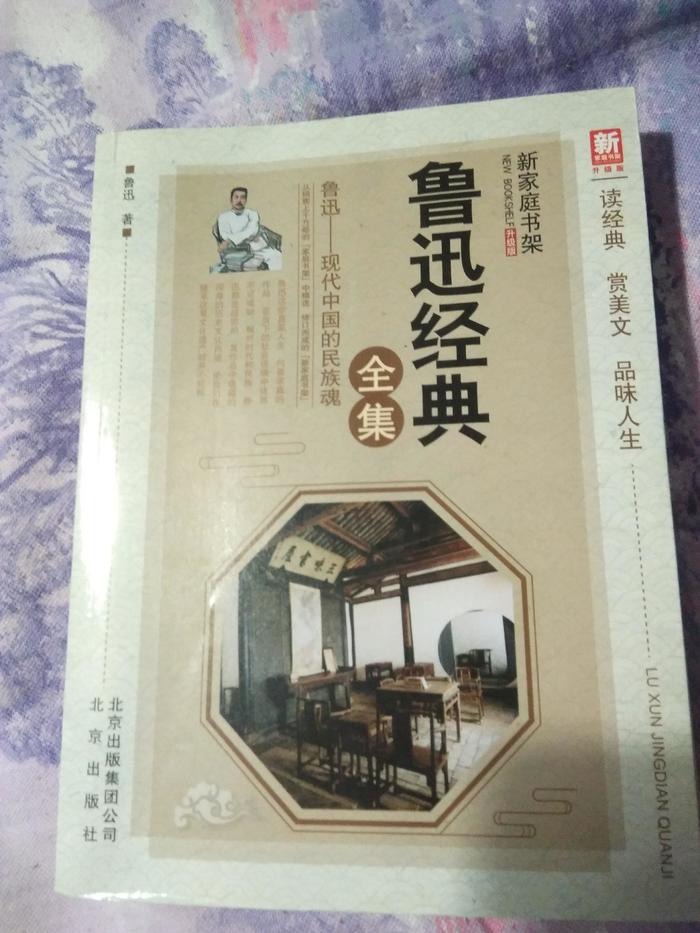

立秋，大概是前两天的事，具体时间记不清楚了，只记得吃了秋膘肉，

        立秋以后，天气也着实凉快了不少，空调也不知什么时候不再一回家就打开了。趁着周末午后没有外出逛街的活动，在书架上翻了翻，一米多高的小书架上塞满了从大学毕业到现在三年多的各种书，麻雀虽小、五脏俱全。

      找来找去，终于找到了一本符合当前心境的书《鲁迅全集》，翻开书的目录，许多熟悉的文章名字映入眼帘，比如孔乙己，狂人日记，阿Q正传……这些在学校里学过的内容的场景都历历在目，无意间发现了书的封面上有一段话，写的很好，摘录下来:鲁迅这些直面人生、向善求真的作品，在当下的社会语境中依然不可或缺。相对时代和民族，鲁迅都是超前的，其作品中蕴藏的深厚的历史文化内涵，使我们在继承这笔文化遗产时并不轻松。

        都说字如其人，而我更加以为执笔写下的内容更能表达人的情感，鲁迅的一生用笔写下的内容我斗胆分为两类，一类是前半生为解救人类的肉体病患而写下的药方，一类是后半生为解救人类的精神病患而写下的“药方”。

        鲁迅的笔虽然没有刀剑那么锋利，没有枪炮那么大的威力，却足以使人致命，只不过鲁迅笔下的解救人类肉体病患的药方能使药方阅读者身体痊愈，而鲁迅笔下的解救人类精神病患的药方却以血的代价给阅读者以精神的震动。我相信鲁迅笔下由描绘救人的药方到描绘吃人杀人的世界的转折的落差反映到的内心变化是悬殊的。从前者到后者的转变，鲁迅的格局也变大了，由救治身体到民族存亡的思考。

        我相信，只有经历了这些，鲁迅的笔下才能写下“不在沉默中爆发，就在沉默中灭亡。”
